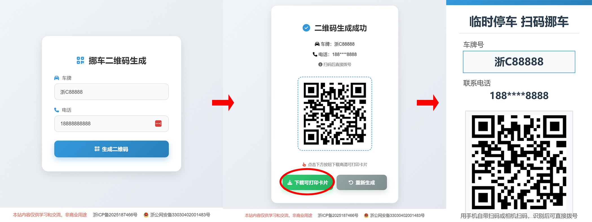

# 挪车二维码生成器

一个纯前端实现的挪车二维码生成工具，输入车牌号和手机号即可生成可打印的高清挪车卡片。

演示地址：https://movecar.937788.xyz/

## 功能特点

- **纯前端实现**：无需后端服务，所有数据仅在本地处理，隐私安全
- **一键拨号**：二维码内容为 `tel:` 协议，扫码后可直接唤起拨号界面
- **电话脱敏**：卡片上显示的电话号码自动脱敏（如 `138****8888`），保护车主隐私
- **高清可打印**：生成 1020×1560 像素的高清卡片图片，适合直接打印使用
- **响应式设计**：适配手机和电脑端访问

## 使用方法

1. 打开网页，输入车牌号和手机号码
2. 点击「生成二维码」按钮
3. 点击「下载可打印卡片」保存高清图片
4. 打印后放置在车内显眼位置

## 扫码说明

- 使用手机相机或系统自带的扫码工具扫描二维码
- 识别后将直接唤起拨号界面，无需打开微信/支付宝

## 技术栈

- HTML5 + CSS3
- Vanilla JavaScript
- [QRCode.js](https://github.com/davidshimjs/qrcodejs) 二维码生成
- Canvas API 绘制可打印卡片

# 截图

